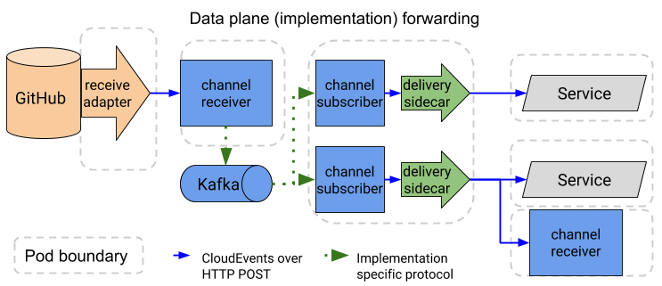

# 设计目标
解耦事件生产者和消费者，遵循CloudEvents规范

# 消费者
事件消费者必须实现如下接口之一
- Addressable 能接收并回复事件，例如k8s service
- Callable 能接收并转换事件

# broker
接收并缓冲（持久化）事件，并且只保留满足CloudEvents规范的属性，例如：
```yaml
apiVersion: eventing.knative.dev/v1alpha1
kind: Broker
metadata:
  name: default
spec:
  channelTemplateSpec:
    apiVersion: messaging.knative.dev/v1alpha1
    kind: InMemoryChannel
```

# trigger
触发器，表示broker与事件消费者之间的订阅关系，能对只包含特定属性的事件过滤，例如：
```yaml
apiVersion: eventing.knative.dev/v1alpha1
kind: Trigger
metadata:
  name: my-service-trigger
spec:
  broker: default
  filter:
    attributes:
      type: dev.knative.foo.bar
      myextension: my-extension-value
  subscriber:
    ref:
      apiVersion: serving.knative.dev/v1
      kind: Service
      name: my-service
```
broker与trigger的关系图


# channel
为broker提供持久化保证，如果broker的spec.channelTemplateSpec属性未指定，则会使用该命名空间名称为default的channel。必须安装default channel,不然好像要报错,更新broker的步骤如下：
- 删除对应broker
- 重新创建同名的broker,并引用新的channel

如果直接修改broker的spec.channelTemplateSpec属性会导致broker中的事件全部丢失

# Event registry
维护所有来自broker可消费的事件类型，指导消费者订阅相关事件。使用如下命令查看指定空间所有事件
```bash
kubectl get eventtypes -n <namespace>
```
如下命令查看特定事件
```
kubectl get eventtype dev.knative.source.github.push-xxx -o yaml
```
事件类型注册方式:
- 手动注册 
```bash
kubectl apply -f <event_type.yaml>
```
- 自动注册，支持如下几种事件源
  - CronJobSource
  - ApiServerSource
  - GithubSource
  - GcpPubSubSource
  - KafkaSource
  - AwsSqsSource
以KafkaSource为例
```yaml
apiVersion: sources.eventing.knative.dev/v1alpha1
kind: KafkaSource
metadata:
  name: kafka-sample
  namespace: default
spec:
  consumerGroup: knative-group
  bootstrapServers: my-cluster-kafka-bootstrap.kafka:9092
  topics: knative-demo,news
  sink:
    apiVersion: eventing.knative.dev/v1alpha1
    kind: Broker
    name: default
```
两个topic对应事件有两个,事件类型为
```
dev.knative.kafka.event(CloudEvents)
```
源
- source: /apis/v1/namespaces/default/kafkasources/kafka-sample#knative-demo
- source: /apis/v1/namespaces/default/kafkasources/kafka-sample#news

目前仅支持sink为broker的事件自动生成

# 构架
1. 事件从源直接发送至Service(k8s service or knative service)，此时需要源做重试及缓存

2. 事件发送至Channel，由channel实现重试，缓存等机制


数据从各组件之间流转如图


# source
事件源也是一种k8s自定义资源，如knative的事件分组为
sources.eventing.knative.dev。K8S提供如下源：
- [核心事件源](https://knative.dev/docs/eventing/sources/index.html)
- [其它事件源](https://knative.dev/docs/eventing/sources/index.html)
- 自定义事件源,需要实现自定义source,实现[示例](https://knative.dev/docs/eventing/samples/writing-a-source/index.html)
或者带接收适配器的source,实现[示例](https://knative.dev/docs/eventing/samples/writing-receive-adapter-source)